# HelixaCare — Virtual Hospital Platform

A full-stack virtual hospital platform providing AI-assisted triage, teleconsultation, remote patient monitoring, and integrated digital health records — built as a **React (Vite)** frontend on top of a **Node.js / Express** REST API and a **37-table PostgreSQL** database. The system serves three roles — **Patient**, **Doctor**, and **Admin** — each with a dedicated dashboard and role-scoped access to the platform's features.

Validated by **554 automated tests across 35 Jest/Supertest suites**.

---

## Screenshots

### Patient

| Dashboard | AVA Triage | Book Appointment |
|---|---|---|
| 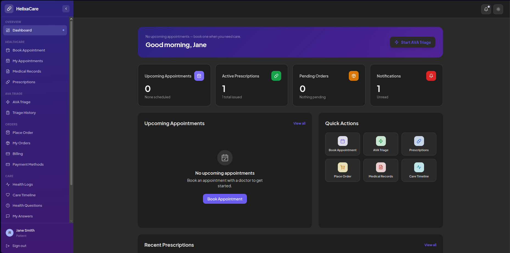 | 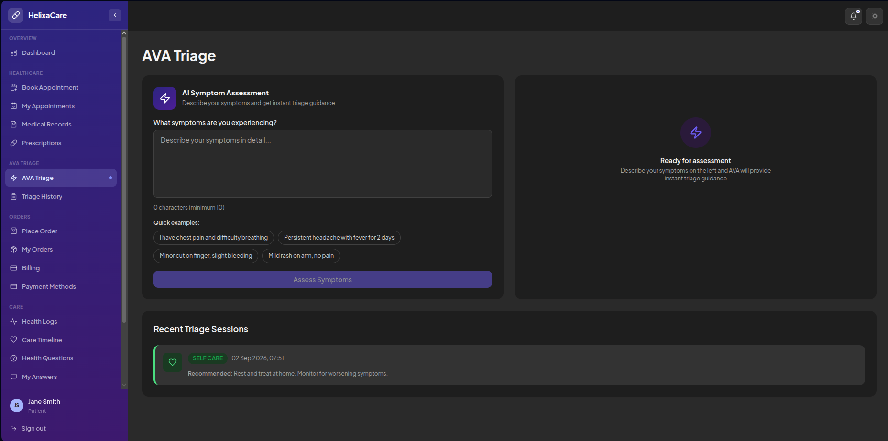 | 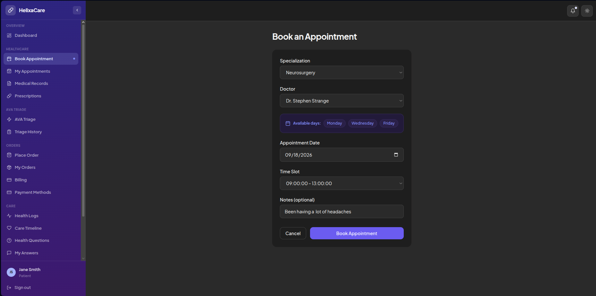 |

| Pharmacy — Place Order | Medical Records | Billing & Payments |
|---|---|---|
| 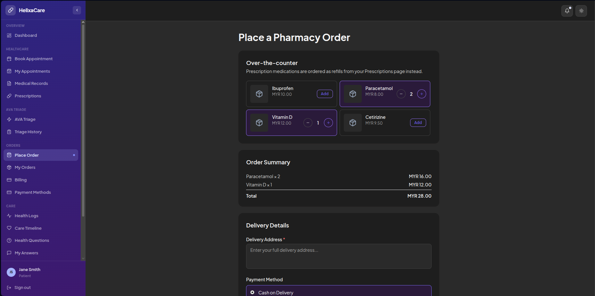 | 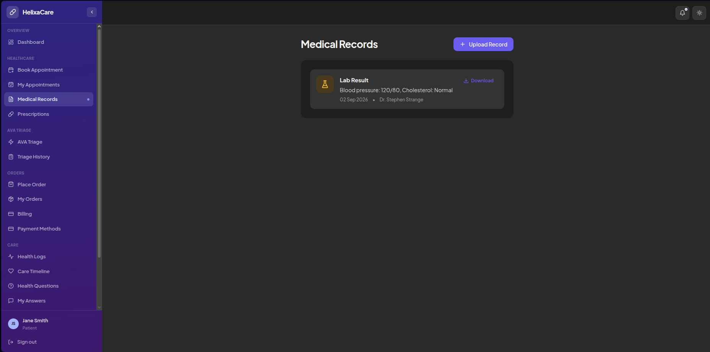 | 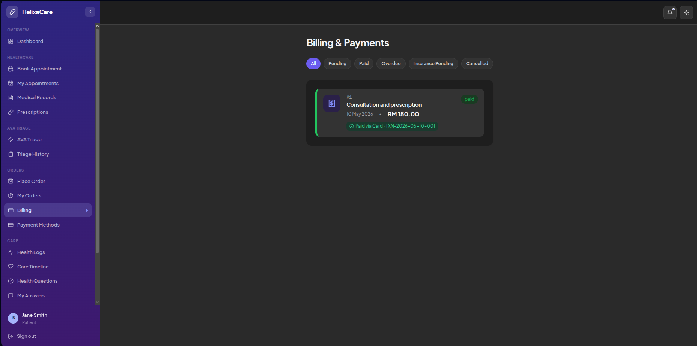 |

### Doctor

| Dashboard | Escalated Triage | Patient Timeline |
|---|---|---|
| 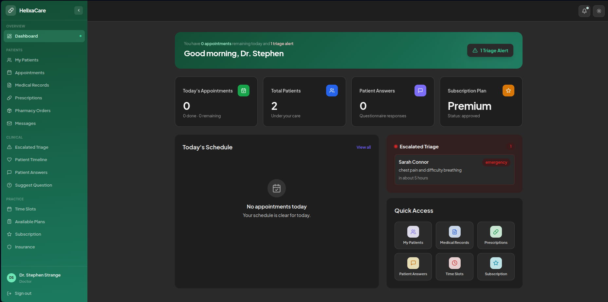 | 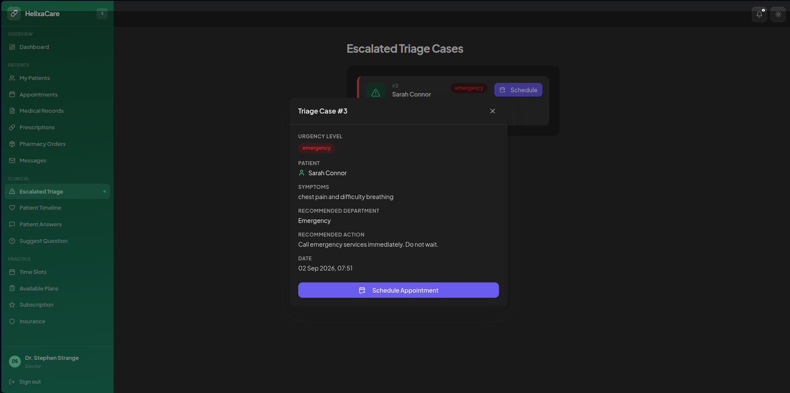 | 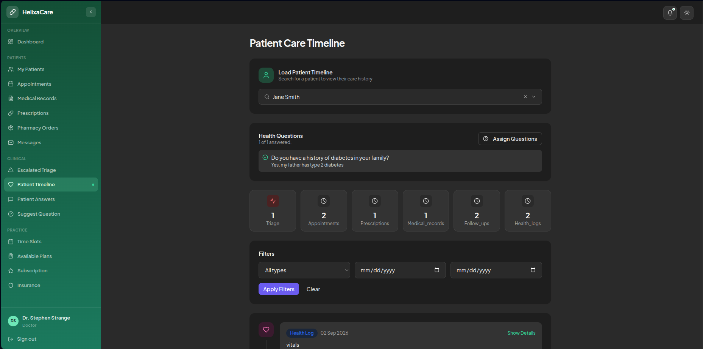 |

| Medical Records | Pharmacy Orders | Time Slots |
|---|---|---|
| 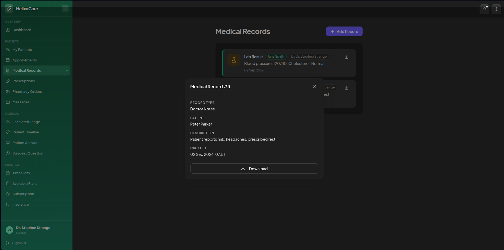 | 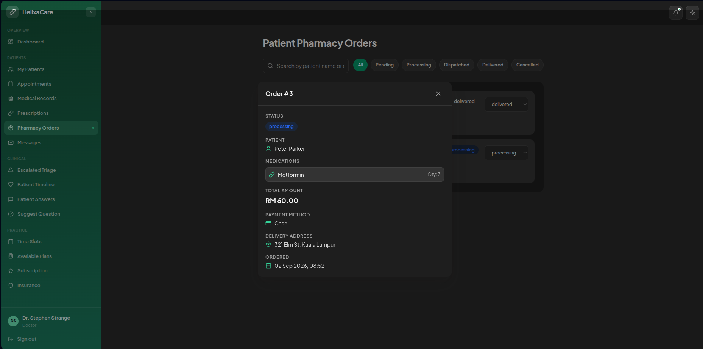 | 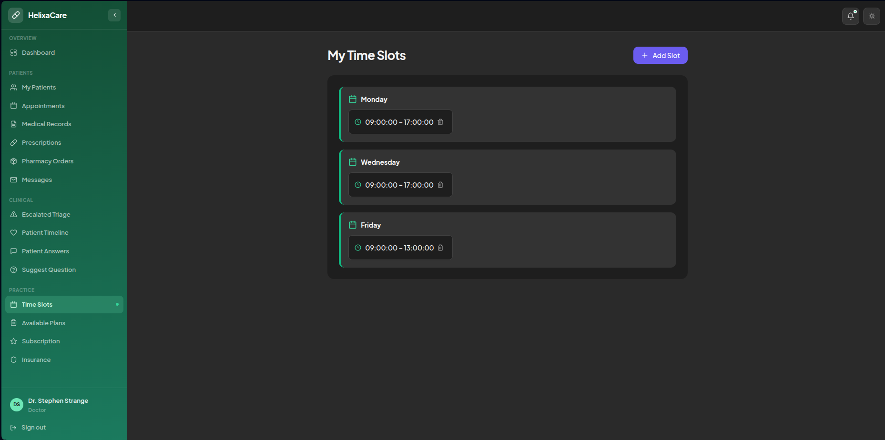 |

### Admin

| Stats & Charts | Database Admin Board | Doctor Subscriptions |
|---|---|---|
| 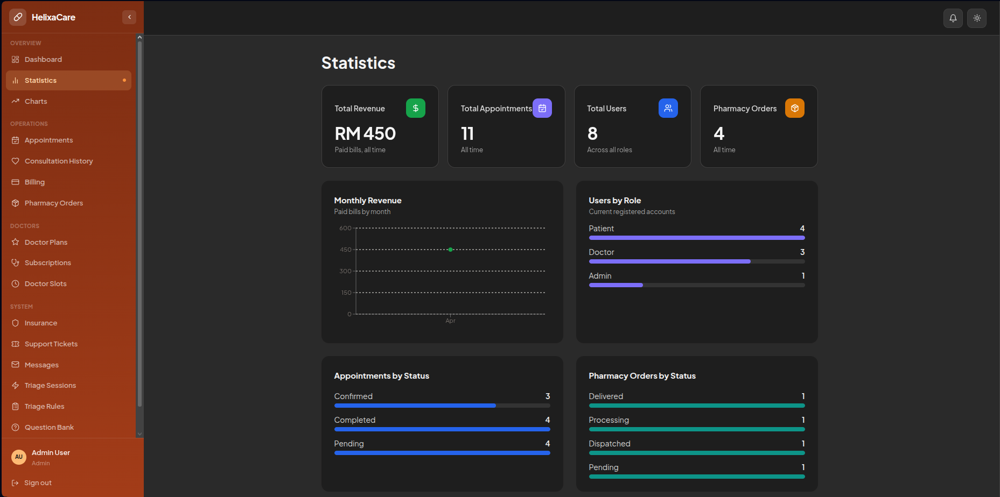 | 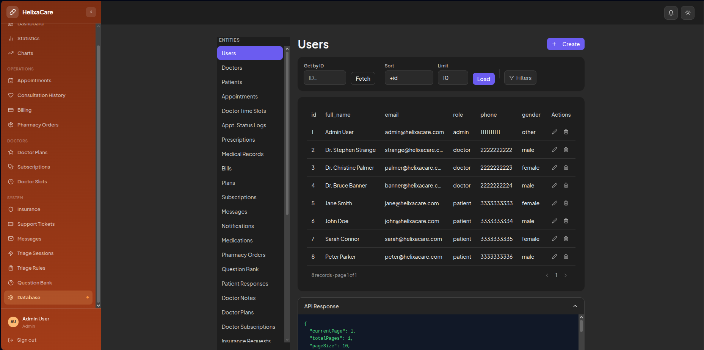 | 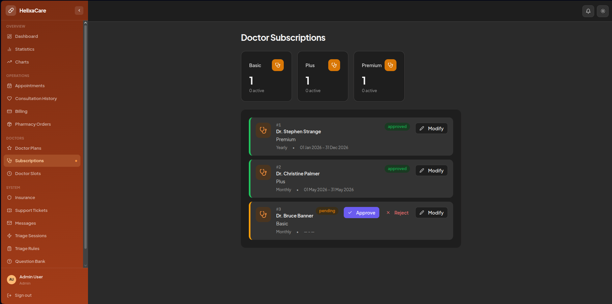 |

| Insurance Requests | Billing | Support Tickets |
|---|---|---|
| 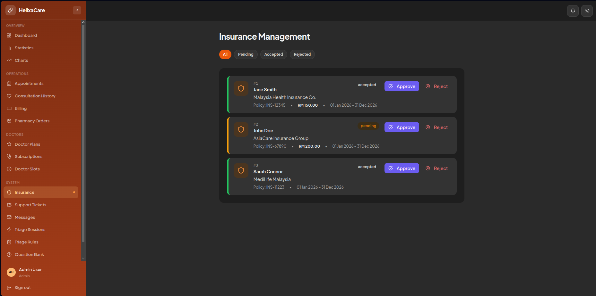 | 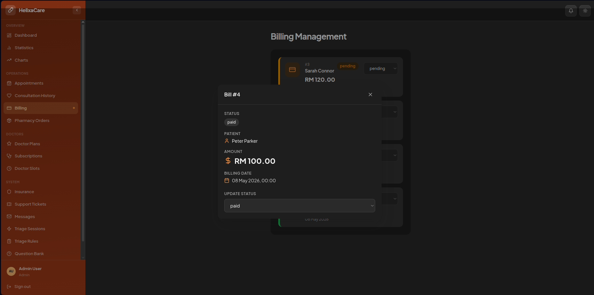 | 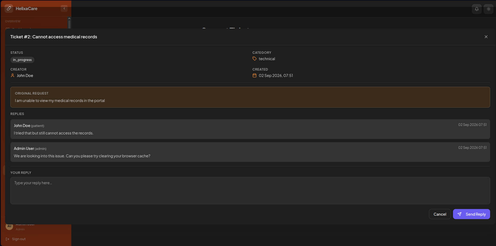 |

---

## Features

### AVA — AI-Assisted Triage
- Symptom classification (self-care / standard / urgent / emergency) via a locally-run LLM (Ollama), with an admin-editable keyword-rule engine as an automatic fallback if the LLM is unreachable — triage never goes down just because Ollama isn't running
- Urgent/emergency cases automatically create a follow-up appointment and notify admins; the doctor's Escalated Triage queue is populated once an admin assigns a reviewing doctor
- Full triage history per patient

### Patient
- Register/login (local + Google/Facebook OAuth), profile management
- AVA symptom triage, triage history
- Book, view, and manage appointments (database-level exclusion constraint prevents any double-booking)
- Follow-up appointments — view, mark complete, or cancel any follow-up a doctor has scheduled
- Enroll/unenroll in admin-run health programs (chronic-care tracking)
- Medical records and prescriptions (encrypted at rest), prescription refill requests
- Pharmacy ordering, order history
- Billing & payments — mock FPX bank transfer or card, saved payment methods, insurance policy display
- Insurance claim submission and tracking
- Chronic-condition health logs and consultation history timeline (including doctor-recorded outcome notes from past consultations)
- Doctor-assigned health questionnaires
- Messaging, notifications, support tickets

### Doctor
- Dashboard with today's schedule, escalated triage alerts, and quick actions
- Patient list and full per-patient care timeline
- Appointment and weekly time-slot management
- Mark a consultation completed with outcome notes, optionally scheduling a follow-up in the same step
- Dedicated follow-up management — create, reschedule, complete (with outcome notes), or cancel
- Write/manage prescriptions, add and edit medical records
- Review and fulfil pharmacy orders for their own patients
- Accept/reject patient insurance claims
- Question bank contributions and patient questionnaire review
- Subscription plan management (Basic / Plus / Premium tiers)

### Admin
- Platform-wide analytics dashboard (revenue, appointments, users by role, top doctors/medications) via Recharts
- Generic Database Admin Board — CRUD access across every core entity, for operational data correction
- Appointment, billing, and pharmacy order oversight platform-wide
- Follow-up oversight — assign/reassign a doctor, reschedule, cancel, and batch-process reminders/missed follow-ups across all patients
- Doctor subscription approval workflow, doctor plan management
- Insurance claim administration
- AVA triage rule configuration (the keyword-based fallback engine) and triage session auditing
- Support ticket resolution, shared question bank moderation

### Platform-Wide
- JWT authentication with a revocation blacklist (logout actually invalidates the token)
- Role-based access control enforced at the middleware layer
- AES-256-GCM field-level encryption for sensitive record content
- Threaded messaging and a shared notification system
- Swagger / OpenAPI documentation
- Rate limiting (login, general API) and Helmet security headers
- Parameterised queries throughout — no raw string-built SQL

---

## Tech Stack

| Layer | Technology |
|---|---|
| Frontend | React 18, Vite, Tailwind CSS, React Router, Recharts |
| Backend | Node.js, Express, raw `pg` driver (no ORM) |
| Database | PostgreSQL (local or Neon cloud), 37 relational tables |
| AI / LLM | Ollama (local), with rule-based fallback |
| Auth | JWT, Passport.js (Google & Facebook OAuth) |
| Payments | Mock FPX / card flow (no live payment gateway) |
| Encryption | AES-256-GCM for sensitive field content |
| File Uploads | Multer |
| PDF / CSV Export | pdfkit, json2csv |
| Security | Helmet, express-rate-limit, bcrypt, express-validator |
| API Docs | Swagger (swagger-jsdoc + swagger-ui-express) |
| Testing | Jest, Supertest (554 tests / 35 suites) |

---

## Getting Started

### Prerequisites
- Node.js 18+
- PostgreSQL (local instance, or a [Neon](https://neon.tech) connection string)

### 1. Clone and install

```bash
git clone https://github.com/zeidhassan/virtual-hospital-platform.git
cd virtual-hospital-platform
npm install
npm install --prefix frontend
```

### 2. Configure environment variables

```bash
cp env.example .env
cp frontend/.env.example frontend/.env
```

Fill in `.env` (see [Environment Variables](#environment-variables) below). The frontend `.env` can usually be left as-is — it defaults to routing API calls through the Vite dev proxy.

### 3. Set up the database

```bash
# Fresh schema + seed data
psql -U your_user -d your_database -f "src/SQL Queries/ProductionSetup.sql"

# Or reset an existing database to clean demo data (safe to re-run)
psql -U your_user -d your_database -f "src/SQL Queries/resetDemoData.sql"
```

### 4. Run it

```bash
# From the project root — starts both the backend (port 5000) and the
# frontend dev server (port 3000) together
npm run dev
```

Or run them separately:

```bash
npm start                        # backend only, http://localhost:5000
npm run dev --prefix frontend    # frontend only, http://localhost:3000
```

### Demo credentials

After running `resetDemoData.sql`, every seeded account logs in with the password **`admin123`**:

| Role | Email |
|---|---|
| Admin | `admin@helixacare.com` |
| Doctor | `strange@helixacare.com` (also `palmer@helixacare.com`, `banner@helixacare.com`) |
| Patient | `jane@helixacare.com` (also `john@helixacare.com`, `sarah@helixacare.com`, `peter@helixacare.com`) |

---

## Environment Variables

```env
# Server
PORT=5000

# DB_MODE: "neon" (cloud connection string) or "local" (discrete credentials)
DB_MODE=local

# Neon / cloud mode
DB_URL=

# Local mode
DB_USER=postgres
DB_HOST=localhost
DB_DATABASE=helixacare_db
DB_PASSWORD=
DB_PORT=5432

# Connection pool tuning (optional)
DB_SSL=false
DB_POOL_MAX=10
DB_IDLE_TIMEOUT_MS=30000
DB_CONN_TIMEOUT_MS=10000

# JWT — required, no fallback (the app will refuse to start without it)
JWT_SECRET=
JWT_EXPIRES_IN=1d

# Field-level encryption for sensitive record content — required, 64 hex
# characters (32 bytes)
ENCRYPTION_KEY=

# OAuth2 (optional — omit to disable social login)
GOOGLE_CLIENT_ID=
GOOGLE_CLIENT_SECRET=
FACEBOOK_CLIENT_ID=
FACEBOOK_CLIENT_SECRET=

# CORS — the frontend origin allowed to call the API
FRONTEND_ORIGIN=http://localhost:3000

# Ollama — powers AVA's LLM-based triage classification. Optional in the
# sense that the app still runs and AVA still works without it (falls back
# to the keyword-rule engine automatically), but Ollama must be installed
# and running locally with the model below pulled for triage to actually
# use the LLM.
OLLAMA_BASE_URL=http://127.0.0.1:11434
OLLAMA_MODEL=llama3:latest
OLLAMA_TIMEOUT_MS=45000
```

The server validates `JWT_SECRET`, `ENCRYPTION_KEY`, and the database mode's required variables at boot, and exits immediately with a clear error if any are missing.

### Optional: enabling LLM-based triage

AVA works out of the box with no extra setup — if Ollama isn't running, triage silently falls back to the keyword-rule engine. To get the actual LLM classification:

```bash
# Install Ollama: https://ollama.com
ollama pull llama3:latest   # or whichever model OLLAMA_MODEL points at
ollama serve                # starts the local server on 127.0.0.1:11434
```

No further configuration is needed — the backend picks it up automatically on the next triage request.

---

## Testing

```bash
npm test          # run the full suite once
npm run watch      # watch mode
npm run coverage   # coverage report
```

Point `.env.test` at a separate database (e.g. `helixacare_test`) before running — integration tests hit a real database.

---

## API Documentation

Swagger UI is served at:

```
http://localhost:5000/api-docs
```

---

## Project Structure

```
virtual-hospital-platform/
├── frontend/                       # React (Vite) SPA
│   └── src/
│       ├── api/                    # Axios modules, one per backend resource
│       ├── components/
│       │   ├── layout/             # Sidebar, Topbar, AppLayout
│       │   └── ui/                 # Reusable UI primitives
│       ├── contexts/                # Auth & theme context providers
│       ├── hooks/                   # useFetch, usePaginatedFetch, useTheme, ...
│       ├── pages/
│       │   ├── admin/               # Admin dashboards & management pages
│       │   ├── doctor/              # Doctor portal pages
│       │   ├── patient/             # Patient portal pages
│       │   ├── auth/                # Login / register
│       │   └── shared/              # Messages, notifications, profile
│       ├── router/                  # Route definitions & role guards
│       └── utils/
│
├── src/                             # Express backend
│   ├── app.js                       # Middleware & route registration
│   ├── config/                      # DB pool, Swagger config
│   ├── controllers/                 # One folder per domain area
│   │   └── databaseAdminBoard/      # Generic CRUD controllers backing the admin board
│   ├── middleware/                  # Auth, RBAC, rate limiting, uploads
│   ├── routes/                      # Express routers (mirrors controllers/)
│   ├── SQL Queries/
│   │   ├── ProductionSetup.sql      # Full schema + seed data
│   │   └── resetDemoData.sql        # Reset to clean demo data (re-runnable)
│   ├── services/                    # External-integration logic (Ollama LLM calls)
│   ├── utils/                       # Encryption, pagination, error handling
│   └── validators/                  # express-validator rule sets
│
├── tests/
│   ├── unit/
│   └── integration/                 # Hits a real database
│
├── server.js                        # Server entry point
├── env.example                      # Backend environment variable template
└── package.json
```

---

## Security

- **JWT** — verified on every protected route, with a revocation blacklist so logout is real
- **AES-256-GCM** — sensitive record content (medical record descriptions, prescription instructions) encrypted at rest
- **Database-level constraints** — a PostgreSQL exclusion constraint prevents doctor double-booking even under concurrent requests, not just an application-level check
- **Helmet** — secure HTTP headers, strict CSP in production
- **HTTPS redirect** — enforced in production behind a reverse proxy (Render, NGINX, etc.)
- **Rate limiting** — brute-force protection on login and general API traffic
- **bcrypt** — password hashing
- **express-validator** — input validation at every route boundary
- **CORS** — restricted to explicitly configured origins
- **Role-based access control** — enforced in middleware, with explicit ownership checks on patient/doctor-scoped resources

---

## Scope Note

This is a proof-of-concept build demonstrating the technical feasibility of an integrated virtual hospital platform. It is not a certified medical product — diagnosis and treatment remain the responsibility of qualified practitioners; AVA is a triage-and-navigation aid, not a diagnostic tool.

---

## License

Proprietary.
